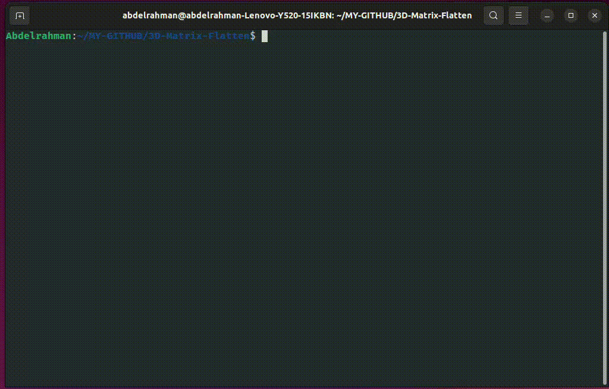

# 3D-Matrix-Faltten

Program to flatten 3D matrix into 1D vector

### Here Implemented A class for the 3D matrix and methods to convert to 1D vector

#### After Running the application you have the ability to build your own matrix and access some operations:

1. initialize each element in the matrix.
2. initialize the whole elements with the same value.
3. set value at specific location.
4. print the matrix.
5. print the 1d vector.
6. get the index of location at 3d matrix in the 1d vector.

### To run the App:

```
g++ matrix_faltter.cpp
./matrix_faltter
```

> Demo Video:


